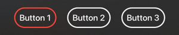
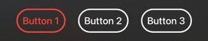

# SwiftUI tvOS custom Button missing accessibility Focused state

This is a demo project showing issue / trouble I have experienced when trying to implement fully customized Button in SwiftUI on tvOS.

It contains minimal demo app and also UI tests showcasing the issue.
Tested and reported on Xcode 13.2.1 and tvOS 15.2


## Summary

Using custom `ButtonStyle` on `SwiftUI.Button` in SwiftUI on tvOS causes the button to loose Focused state in Accessibility.

The button then does not appear Focused in UI tests, which can be a big issue on tvOS.

Not sure if this is a bug or expected. Anyway, I haven't found any resources on how to implemented custom `ButtonStyle` and still get the same Focus behavior as the native button styles do have. Any ideas appreciated!


## What is the problem?

The button can be made to visually _look_ focused, but it will be missing Focused state (`hasFocus`) in Accessibility APIs.
That causes issues for example in UI tests if we rely on [XCUIElement.hasFocus](https://developer.apple.com/documentation/xctest/xcuielement/attributename/3022458-hasfocus).

You can use `hasFocus` for many UI tests tasks on tvOS. Naming few examples:

- Simplify navigation and traversing focusable elements
- Testing that button gets focused on action
- Waiting on screen appear until it has some focused element


## Why do you need custom ButtonStyle on tvOS?

Apple provides few predefined button styles for which Focused style behaves correctly. However, customization options on tvOS are heavily limited. All these styles will add its own UI (e.g. backgrounds).

What if I need custom looking button on tvOS? Look at the example where first button is focused:

| First button focused | First button focused and pressed |
|---|---|
|  |  |

- Button has red border when **focused**
    - This can be implemened using `@Environment(\.isFocused)` in label content
- Button has red foreground color when **pressed**
    - ⚠️ This can only be implemented using custom `ButtonStyle` where its `Configuration` has `isPressed` property

And here we are. We need custom style, but it will break out tests...


## How does the issue surface?

Once you set custom button style

```
 Button(...)
    .buttonStyle(AnyCustomButtonStyle())
```

You can get buttons to look focused, yet it does not appear focused from tests Accessibility perspective.
And because of that, all the focus related logic and APIs in tests will fail.

Compare these 2 outputs from debugger printing a structure of the demo app inside tests:


### Without custom style

```
(lldb) po app
Attributes: Application, 0x12ed10b30, pid: 61273, label: 'FocusSwiftUI'
Element subtree:
 →Application, 0x12ed10b30, pid: 61273, label: 'FocusSwiftUI'
...
              Button, 0x12ed0c660, {{468.0, 477.0}, {298.0, 126.0}}, label: 'Button 1'
                Button, 0x12ed0c770, {{453.0, 470.7}, {328.0, 138.7}}, Focused
              Button, 0x12ed0c1e0, {{806.0, 477.0}, {303.0, 126.0}}, label: 'Button 2'
                Button, 0x12ed0c2f0, {{791.0, 470.8}, {333.0, 138.5}}
              Button, 0x12ed0c400, {{1149.0, 477.0}, {304.0, 126.0}}, label: 'Button 3'
                Button, 0x12ed0c510, {{1134.0, 470.8}, {334.0, 138.4}}
...
```

Notice there is a `Focused` button in the output. This will return true for `XCUIElement.hasFocus`.
Interestingly enough, there are two Accessibility buttons for each SwiftUI. I don't really know why...

- Outer one, which has label (e.g. "Button 1")
- Inner one, which has `Focused` property set

I don't really know why the buttons are structured like that in Accessibility. May be just my lack of knowledge to understand why it is like this...


### With custom button style

Once you apply custom style, the Accessibility output changes drastically.

```
(lldb) po app
Attributes: Application, 0x106d0cd40, pid: 70156, label: 'FocusSwiftUI'
Element subtree:
 →Application, 0x106d0cd40, pid: 70156, label: 'FocusSwiftUI'
 ...
              Button, 0x106d0ce50, {{707.0, 505.0}, {142.0, 71.0}}, label: 'Button 1'
              Button, 0x106d0cf60, {{885.0, 505.0}, {146.0, 71.0}}, label: 'Button 2'
              Button, 0x106d0d180, {{1067.0, 505.0}, {147.0, 71.0}}, label: 'Button 3'
...
```

- No more nested button
- And more importantly: **NO MORE FOCUSED STATE**


---

## Solutions or workarounds?

Some workarounds are theoretically possible. But all of them are hacks (maybe stuff like disabling custom styles in UI tests...?)

I am not sure if this is a bug or what is going on.

In case it is not a bug, I believe many people would appreciate sample code or clear documentation how to implement behavior similar to the one of default button styles (like `CardButtonStyle`), but without that extra behavior.